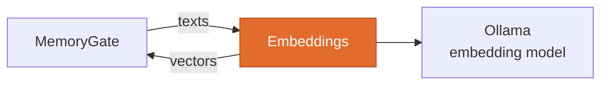

<p align="center"></p>
<h1 align="center">Embeddings</h1>
<p align="center"><b>Text to vectors. Nothing else.</b><br/>
A stateless service with a strict contract, so the embedding model is a deployment choice, not a rewrite.</p>
<p align="center">
  <a href="https://github.com/Conker-AI/embeddings/actions/workflows/ci.yml"></a>
  
  <a href="LICENSE"></a>
  <a href="https://github.com/Conker-AI/conker"></a>
</p>

One job, one boundary: it holds no memory, takes no action and observes no machine.
[MemoryGate](https://github.com/Conker-AI/memorygate) calls it to turn text into vectors, and it
reports honestly when it cannot. Part of [Conker](https://github.com/Conker-AI/conker).

## Where it fits



## Its boundary

It **embeds**. It never stores, never retrieves, never decides what is worth remembering. Callers
own their own index; this service is stateless between requests.

Existing separately is the point. MemoryGate used to load a model inside its own API process, which
tied a web API's startup to a model load and made the provider unswappable. Behind an HTTP contract
the model is a deployment choice — swapping it is a compose change, not a rewrite.

## Quick start

```bash
cp .env.example .env
echo "EMBEDDINGS_ADMIN_KEY=$(openssl rand -base64 24)" >> .env
docker network create conker_net   # if it does not exist yet
docker compose up -d --build
docker compose exec ollama ollama pull qwen3-embedding:0.6b
```

API: `http://127.0.0.1:8030`. Every route except `/health` requires
`X-Embeddings-Key: <EMBEDDINGS_ADMIN_KEY>`.

The service **refuses to start** without a key of at least 16 characters, and says how to fix it. It
never falls back to open.

## Configure

Precedence is **environment → file → default**.

| Variable | Default | Meaning |
|---|---|---|
| `EMBEDDINGS_ADMIN_KEY` | *(required)* | At least 16 characters, or the service will not start. |
| `EMBEDDINGS_MODEL` | `qwen3-embedding:0.6b` | Multilingual, ~1.5 GB. |
| `EMBEDDINGS_DIMENSION` | `1024` | Must match the model. Declared, not inferred — see below. |
| `EMBEDDINGS_OLLAMA_URL` | `http://ollama:11434` | Where the backend is. |
| `EMBEDDINGS_PORT` | `8030` | |

**Low-resource preset**, for a machine that cannot spare 1.5 GB:

```
EMBEDDINGS_MODEL=embeddinggemma:300m
EMBEDDINGS_DIMENSION=768
```

**Why Qwen3 and not the model MemoryGate's docs once promised.** `all-MiniLM-L6-v2` is English-first
and from 2021. Conker's memory is substantially bilingual, and retrieval that degrades on half the
corpus fails silently and asymmetrically — worse than failing outright. See
[ADR-0004](https://github.com/Conker-AI/conker/blob/main/docs/adr/0004-multilingual-embeddings-from-a-sidecar.md).

## API

| Route | Auth | |
|---|---|---|
| `GET /health` | none | Module contract shape. Probes the backend and whether the model is pulled. |
| `GET /model` | key | Model identity and dimension. |
| `POST /embed` | key | `{"texts": [...]}` → `{"model", "dimension", "vectors"}`. Up to 256 per call. |

**Dimension is part of the contract, not a detail.** Changing the model changes the vector width and
invalidates every stored vector, so a caller must be able to detect the change *before* it writes.
`/embed` refuses to return a vector whose width does not match the declared dimension — a
wrong-width vector written into an index built for another shape is a corruption that surfaces much
later, as bad search results rather than an error.

`/embed` answers **503**, not 500, when the backend is unavailable. That is the caller's signal to
degrade to lexical retrieval and say so, not to treat the failure as a bug in its own request.

## Status vocabulary

`/health` reports `ok`, `degraded`, `unavailable`, `not_configured` or `unknown` per check.
`not_configured` is **not** a failure. Reachability and model presence are separate checks, because
a reachable backend with the model unpulled is a different problem from an unreachable one, and a
caller that cannot tell them apart cannot act on either.

Nothing is ever reported `ok` because it was configured. Every check is probed.

## Development

```bash
pip install -r requirements-dev.txt
python -m pytest -q
```

## License

[MIT](LICENSE)
